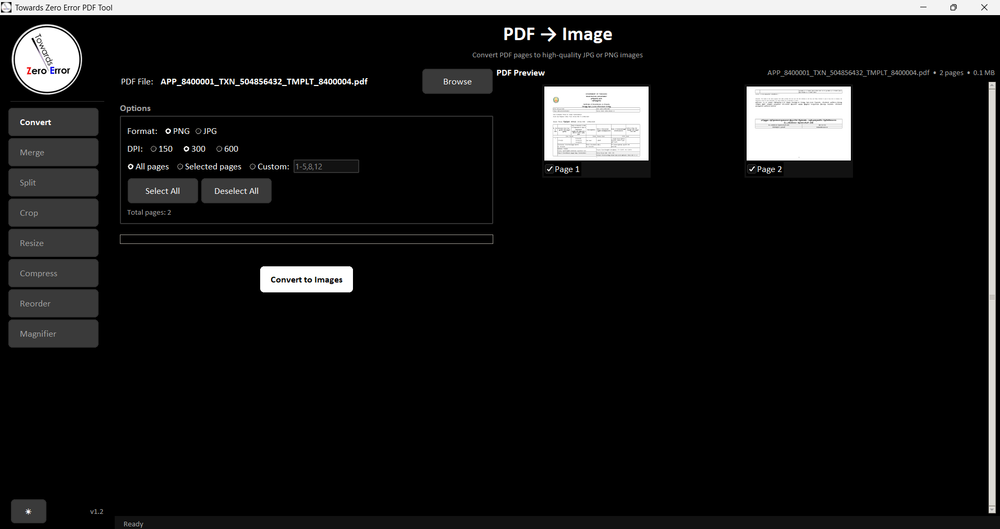

# 📄 Towards Zero Error PDF Tool

  <b>Lightweight • Fast • Portable PDF Utility built with Python</b>

  
  
  
  

---

## 🖥️ Application Preview

  
  

  
  

---

## ⬇️ Download

  

  📌 Portable executable — No installation required

---

## 💻 System Compatibility

  ✅ Windows 7 &nbsp;&nbsp; | &nbsp;&nbsp; ✅ Windows 10 &nbsp;&nbsp; | &nbsp;&nbsp; ✅ Windows 11

---

## ✨ Features

### 🔄 Conversion
- PDF → Image (JPG / PNG)  
- Image → PDF  

### 📂 PDF Tools
- Merge PDFs  
- Split PDFs  
- Reorder Pages  
- Crop & Resize  
- Compress PDFs  

### 🖼️ Image Tools
- Compress images  
- Resize images  
- Format conversion  

---

## 🎨 User Interface

- 🌙 Dark Mode  
- ☀️ Light Mode  
- ⚡ Fast & responsive  
- 📌 Sidebar navigation  
- 🖼️ Live preview  

---

## ⚙️ Tech Stack

  Python • Tkinter • PyMuPDF • Pillow

---

## 📦 Deployment

- ✔️ Portable `.exe`  
- ❌ No installation required  
- 📁 Size < 25 MB  

### ▶️ Usage
1. Download the `.exe`  
2. Double-click to run  
3. Select the required tool  
4. Start processing instantly  

---

## 📊 Performance

- ⚡ Fast execution  
- 💾 Low memory usage  
- 📁 Efficient for large files  
- 🧠 Optimized processing  

---

## 🎯 Objective

To build a simple, efficient, and error-free PDF toolkit without heavy dependencies or complex setup.

---

## 👨‍💻 Author

**Nithish Praba M P**

---

## 📌 Version

v1.2
